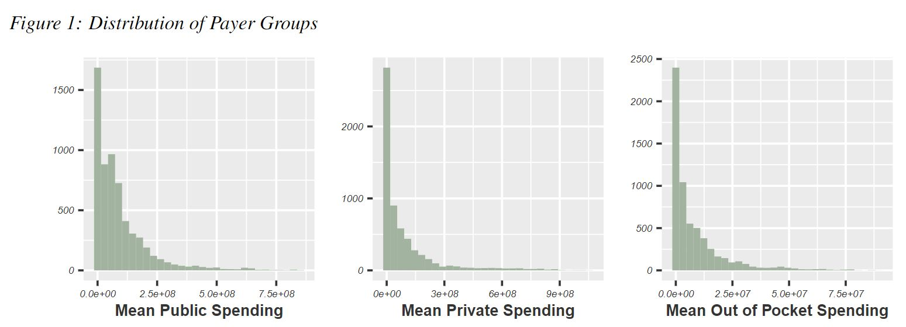
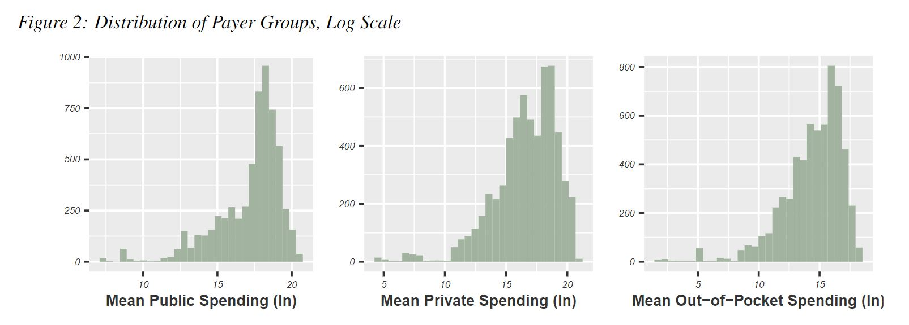
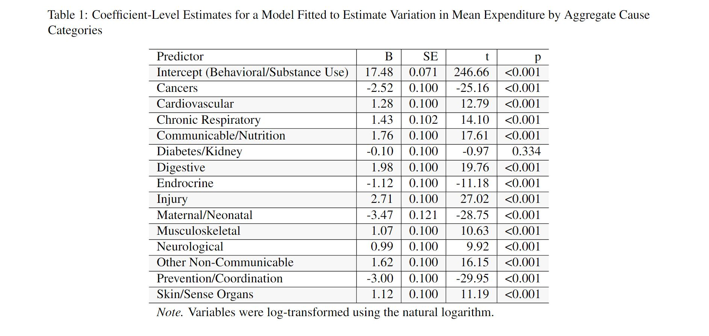
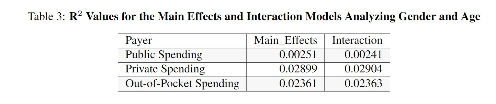
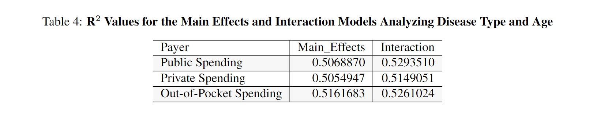

```{r load-packages, include = FALSE}
# Add any additional packages you need to this chunk
# Remove any packages from this list that you're not using
library(tidyverse)
library(tidymodels)
library(palmerpenguins)
library(knitr)
library(xaringanthemer)
library(kableExtra)
```

```{r setup, include=FALSE}
# For better figure resolution
knitr::opts_chunk$set(
  fig.retina = 3, 
  dpi = 300, 
  fig.width = 6, 
  fig.asp = 0.618, 
  out.width = "70%"
  )
```

```{r load-data, include=FALSE}
unzip("../data/IHME_DEX_ED_SPENDING_2006_2016_DATA.zip", exdir =  "../data/spending_data_unzip")

spending <- read.csv("../data/spending_data_unzip/IHME_DEX_ED_SPENDING_2006_2016_DATA_Y2021M09D23.CSV")

spending_malefemale <- spending %>%
  filter(sex %in% c("Female", "Male")) %>%
  filter(age_group_name != "All Ages")

spending_malefemale <- spending_malefemale %>%
  filter(mean_all != 0) %>%
  filter(mean_pub != 0) %>%
  filter(mean_pri != 0) %>%
  filter(mean_oop != 0) %>%
  mutate(lmean_all = log(mean_all)) %>%
  mutate(lmean_pub = log(mean_pub)) %>%
  mutate(lmean_pri = log(mean_pri)) %>%
  mutate(lmean_oop = log(mean_oop))
```

```{r style-slides, echo = FALSE}
style_xaringan(
  title_slide_background_image = "img/markus-spiske-iar-afB0QQw-unsplash.jpg"
)
```

class: inverse, middle, center

background-color: #217718

# Background Information and Significance

Emergency services ensure that individuals can receive timely care for unexpected ailments and injuries, making them a vital component of the healthcare industry. However, in recent years, emergency service spending has seen a significant increase (Scott and Liu 2021), which begs the question of whether access to these service remain equitable to all. Expenditure is one of many ways to investigate healthcare access, which is why we look to understand how various social factors, such as gender and age, affect spending for the US healthcare system's different payers.


---

## Introducing the Data Set

--

- Our data is provided by the Institute of Health Metrics and Evaluation as part of the Disease Expenditure Project (DEX).

--

- The health spending data include estimates for U.S. emergency spending on health care divided into three types of payers: public insurance (including Medicare, Medicaid, and other government programs), private insurance, and out-of-pocket payments

--

- A few of the important variables that will be used in the analysis include: age, gender, disease type, total mean spending.

---

## Introducing the Data Set

--

- The nature of the original dataset is not normally distributed.

--

```{r photo_1, echo = FALSE, out.width = "100%", fig.align = "center"}



```

---

## Introducing the Data Set

--

- A log transformation of the data solves this issue.

--

```{r photo_2, echo = FALSE, out.width = "100%", fig.align = "center"}



```

---
class: inverse, middle, center

background-color: #217718

# Data Analysis

The general approach we took was to analyze various social factors to understand their impact on spending for emergency services. This was followed by studies of interactions between multiple social factors on the spending of the three payers we delineated earlier.

---

## Gender
--

- Is gender a factor in influencing emergency department spending?

--

- We performed a t-test looking at the overall differences in log mean emergency department spending between males and females.

--

- This t-test showed that for mean spending of all emergency services payment types, the p value is 0.1543 (95% CI -0.0315862, 0.1996079).

--

- Therefore, there is not a significant difference between male and female spending for mean emergency services.

---

## Age
--

- Is age a factor in influencing emergency department spending?

--

- The age variable is split into 19 groups and generally increases by 5-year increments. 
--

- We first used an overall test with ANOVA on the log scale to evaluate the null hypothesis that all of the means for age groups across the years are equal. 

--

- In our F-test (ndf = 18, ddf = 6031), a significant difference among age groups was identified. 

---

## Age
--

- We followed the ANOVA analysis with step-down tests.

--

- The pairwise t-tests evaluated 99/171 differing combinations, which was consistent with our hypothesis that (a majority of) age group pairs differ in terms of mean expenditures.

--

```{r age-expenditure-boxplot, echo = FALSE, warning = FALSE, message = FALSE, fig.height = 2.5, fig.width = 6, fig.align = "center"}
  
ggplot(data = spending_malefemale, aes(x = age_group_name, y = lmean_all)) +
  geom_boxplot() +
  theme(
    axis.text.x = element_text(color = "grey20", size = 5, 
                               face = "italic", angle = 45,hjust = 1),
    axis.text.y = element_text(color = "grey20", size = 5, face = "italic"),
    axis.title.y = element_text(color = "grey20", size = 8, face = "bold"),
    axis.title.x = element_text(color = "grey20", size = 8, face = "bold"),
    plot.title = element_text(color = "grey20", face = "bold")
        ) +
  scale_y_continuous(labels = scales::comma) +
  labs(
    x = "Age Group",
    y = "Mean Spending, All Payers (ln)",
    title = "Emergency Department General Expenditures"
       )
```

---

## Health Category

--

- Does health category have an impact on emergency department expenditures?

--

- We performed a one-way ANOVA (ndf = 14, ddf = 6035) to compare the way the health issue an individual entered the emergency room would affect log mean ED expenditures. The null hypothesis used was that the means of spending for all health categories are equal.

--

- We rejected the overall null hypothesis of no effect. We, then, performed step-down tests using a Holm correction for multiple comparisons, which indicated that 92/105 category pairs differ in mean expenditure.

--

- We performed a linear regression. All predictors were found to be significant (alpha < 0.05) in predicting mean spending except for the diabetes and kidney diseases predictor.

---

## Health Category

--

- Significant regression values:

```{r photo_3, echo = FALSE, out.width = "90%", fig.align = "center"}



```


---

## Health Category

--

- To see if health category spending changed over time, we also visualized our data on a barplot. 

--

```{r spending_time_graph, echo = FALSE, warning = FALSE, message = FALSE, fig.align = "center"}
spending_malefemale$disease_renamed <- factor(spending_malefemale$agg_cause, 
            labels = c("Behavioral/Substance Use", "Cancers", "Cardiovascular", "Chronic Respiratory", "Communicable/Nutrition", "Diabetes/Kidney", "Digestive", "Endrocrine", "Injury", "Maternal/Neonatal", "Musculoskeletal", "Neurological", "Other Non-Communicable", "Prevention/Coordination", "Skin/Sense Organs"))

spending_malefemale %>%
  ggplot(aes(x = year_id,
             y = lmean_all,
             fill = disease_renamed)) +
  geom_bar(stat = "identity") +
  scale_fill_manual(values = c(
    "#b3a2a1", "#b3a8a1", "#b3aea1", "#b3b1a1", "#a3b3a1", "#a1b3a9", 
    "#a1b3b1", "#a1b1b3", "#a1a3b3", "#a9a1b3", "#aea1b3", "#b1a1b3",
    "#b3a1ac", "#b3a1a6", "#b3a1a6"
    )) +
  facet_wrap(~disease_renamed) +
  theme(axis.text.x = element_text(
    color = "grey20", size = 5, face = "italic",
    angle = 45, hjust = 1),
    legend.position = "none",
    axis.text.y = element_text(color = "grey20", size = 5, face = "italic"),  
    axis.title.x = element_text(color = "grey20", size = 8, face = "bold"),
    axis.title.y = element_text(color = "grey20", size = 8, face = "bold"),
    plot.title = element_text(color = "grey20", face = "bold"),
    strip.background = element_rect(color = "grey20", fill = "white"),
    strip.text.x = element_text(size = 7)
        ) +
  labs(
    title = "Log Mean Spending by Disease",
    x = "Disease Category",
    y = "Aggregate Log Spending Values")
  
```

---

## Health Category

- Because we saw that spending varied over time based on disease category, we performed a linear regression predicting log of all mean spending based on disease category and year with a disease category year interaction term.

--

- The linear model showed all year disease interaction terms are not significant with p values greater than 0.05, and p values for the 2016 predictor (p = 0.133) and diabetes and kidney disease predictor (p = 0.788) also not significant predictors in the model. 

---

## Health Category and Gender

--

- Is there a relationship between health category and gender in influencing emergency department spending?

--

- A main effects and interaction effects model were fitted to the data. 

--

- The interaction of gender and age slightly increases the accuracy of the regression for public and private spending, but for out-of-pocket spending, it decreases the adjusted R squared value.

--

```{r photo_4, echo = FALSE, out.width = "90%", fig.align = "center"}



```

---

## Health Category and Age

--

- Is there a relationship between health category and age in influencing emergency department spending?

--

- We performed multiple regressions using main effects and interaction models for each of the three spending models 

--

- For public spending, private spending, and out of pocket spending, the adjusted R squared values increased with the inclusion of an interaction term, leading us to the conclusion that the interaction model better fits the data for all three types of payers. 

--

```{r photo_5, echo = FALSE, out.width = "90%", fig.align = "center"}



```

---

class: inverse, middle, center

background-color: #217718

## Conclusion and Discussion

---

## References

Institute for Health Metrics and Evaluation (IHME). United States Healthcare Spending in Emergency Departments byHealth Condition 2006-2016. Seattle, United States of America: Institute for Health Metrics and Evaluation (IHME),2021.

Woody Scott K, Liu A, Chen C, Kaldjian AS, Sabbatini AK, Duber, HC, Dieleman JL. Healthcare Spending in U.S.Emergency Departments by Health Condition, 2006-2016. PLOS One. 27 October 2021.
